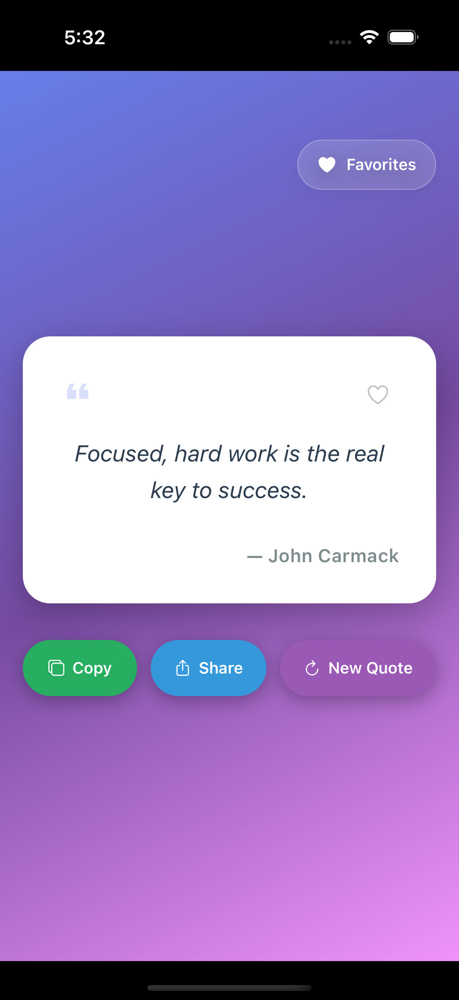
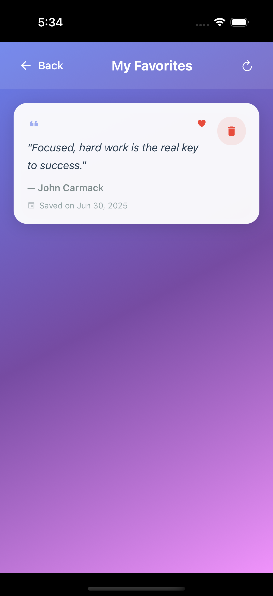
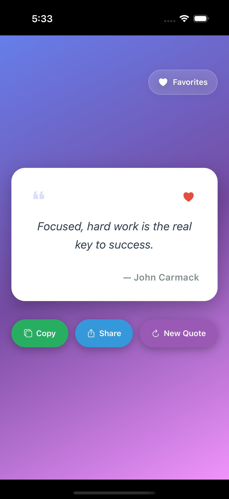
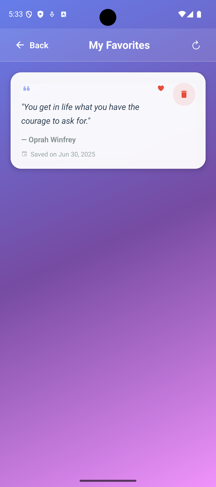
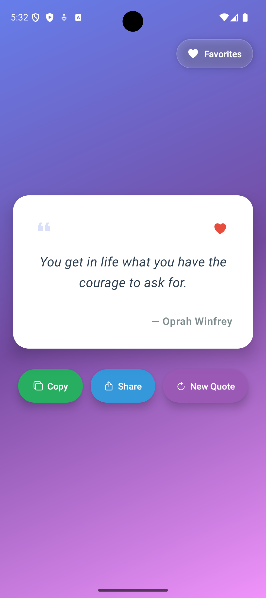
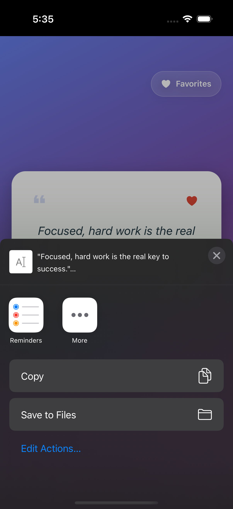
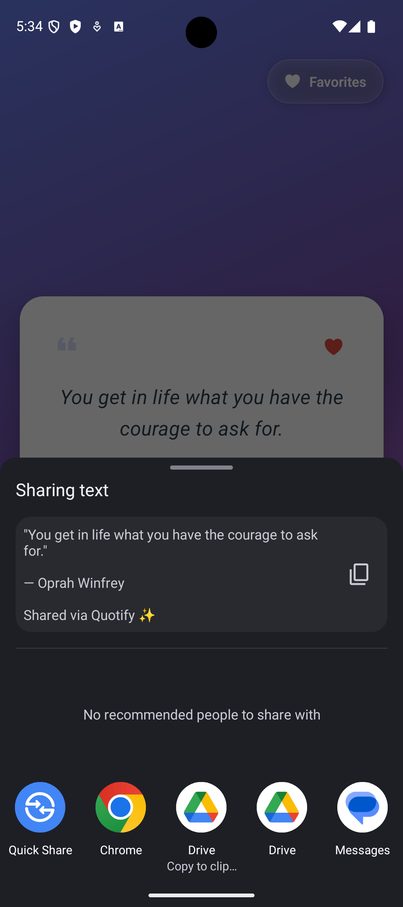
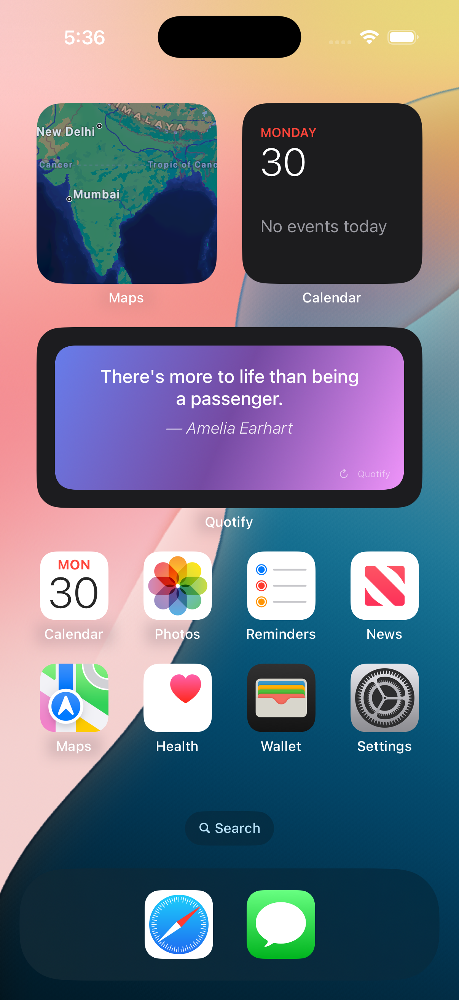
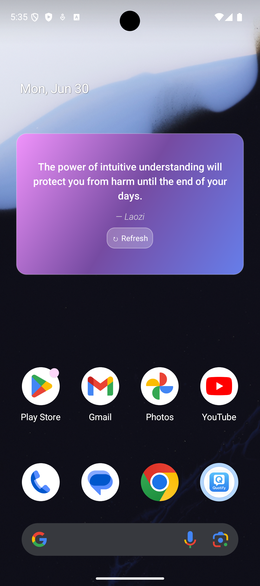

<div align="center">

# 🌟 Quotify

### *Daily inspiration at your fingertips*

A beautiful React Native app with 2,127+ inspiring quotes, home screen widgets, and elegant design. Works completely offline with instant quote loading.

[](https://reactnative.dev/)
[](https://github.com/facebook/react-native)
[](LICENSE)

[Features](#-features) • [Screenshots](#-screenshots) • [Installation](#-installation) • [Usage](#-usage) • [Widgets](#-widgets)

</div>

---

## ✨ Features

### 🎯 **Core Features**
- **Random Quote Generation** - Instant access to 2,127+ inspiring quotes
- **Fully Offline** - No internet connection required, works anywhere
- **Favorites System** - Save and manage your favorite quotes
- **Beautiful UI** - Stunning gradient backgrounds and modern design
- **Cross-Platform** - Available for both iOS and Android

### 📱 **Home Screen Widgets**
- **iOS Widgets** - WidgetKit-based home screen widgets
- **Android Widgets** - Native home screen widgets
- **Auto-Updates** - Widgets refresh every 30 minutes
- **Manual Refresh** - Tap to refresh widget content
- **Seamless Sync** - Widgets update when you fetch new quotes in the app

### 🚀 **Smart Features**
- **Local Quote Database** - 2,127+ curated quotes stored locally for instant access
- **Lightning Fast** - No loading times or network dependencies
- **Share Functionality** - Share quotes with friends
- **Copy to Clipboard** - Quick copy for easy sharing
- **Elegant Animations** - Smooth transitions and loading states

---

## 📸 Screenshots

### Main App Experience
<div align="center">
  <table>
    <tr>
      <td align="center"><strong>iOS</strong></td>
      <td align="center"><strong>Android</strong></td>
    </tr>
    <tr>
      <td></td>
      <td></td>
    </tr>
    <tr>
      <td><em>Beautiful gradient UI with inspiring quotes</em></td>
      <td><em>Cross-platform consistency</em></td>
    </tr>
  </table>
</div>

### Favorites & Sharing
<div align="center">
  <table>
    <tr>
      <td align="center"><strong>Favorites Management</strong></td>
      <td align="center"><strong>Adding to Favorites</strong></td>
    </tr>
    <tr>
      <td></td>
      <td></td>
    </tr>
    <tr>
      <td></td>
      <td></td>
    </tr>
    <tr>
      <td><em>Manage your saved quotes</em></td>
      <td><em>Heart to save inspirational quotes</em></td>
    </tr>
  </table>
</div>

### Share Functionality
<div align="center">
  <table>
    <tr>
      <td align="center"><strong>iOS Share</strong></td>
      <td align="center"><strong>Android Share</strong></td>
    </tr>
    <tr>
      <td></td>
      <td></td>
    </tr>
    <tr>
      <td><em>Native iOS sharing experience</em></td>
      <td><em>Android system share integration</em></td>
    </tr>
  </table>
</div>

### Home Screen Widgets
<div align="center">
  <table>
    <tr>
      <td align="center"><strong>iOS Widget</strong></td>
      <td align="center"><strong>Android Widget</strong></td>
    </tr>
    <tr>
      <td></td>
      <td></td>
    </tr>
    <tr>
      <td><em>WidgetKit integration with auto-updates</em></td>
      <td><em>Native Android widget with refresh button</em></td>
    </tr>
  </table>
</div>

---

## 🛠 Installation

### Prerequisites

- **Node.js** 18+ 
- **React Native CLI** 
- **Android Studio** (for Android development)
- **Xcode** 12+ (for iOS development)

### Quick Start

1. **Clone the repository**
   ```bash
   git clone https://github.com/yourusername/quotify.git
   cd quotify
   ```

2. **Install dependencies**
   ```bash
   npm install
   ```

3. **iOS Setup**
   ```bash
   cd ios
   bundle install
   bundle exec pod install
   cd ..
   ```

4. **Run the app**
   ```bash
   # For iOS
   npm run ios
   
   # For Android
   npm run android
   ```

---

## 🎮 Usage

### Getting Started
1. **Launch the app** to see your first inspiring quote
2. **Tap "New Quote"** to instantly get a fresh quote from our local collection
3. **Tap the heart icon** to save quotes to your favorites
4. **Use the share button** to spread inspiration with friends
5. **Access favorites** via the favorites button in the top corner

### Always Available
- Quotify works completely offline with 2,127+ curated quotes stored locally
- No internet connection required - perfect for travel or low connectivity areas
- Instant quote loading with no network delays
- All features including favorites work without any internet connection

---

## 📲 Widgets

### Android Widgets
1. **Long press** on your home screen
2. **Select "Widgets"** from the menu
3. **Find and add** the Quotify widget
4. **Enjoy** automatic quote updates every 30 minutes

### iOS Widgets
1. **Long press** on your home screen
2. **Tap the "+" button** in the top corner
3. **Search for "Quotify"** in the widget gallery
4. **Choose your size** (Small or Medium) and add to home screen

### Widget Features
- ✅ Auto-refresh every 30 minutes
- ✅ Manual refresh by tapping
- ✅ Seamless app integration
- ✅ Beautiful gradient design
- ✅ Works completely offline with local quotes

---

## 🏗 Tech Stack

### Core Technologies
- **React Native** 0.80.0 - Cross-platform mobile framework
- **TypeScript** - Type-safe JavaScript
- **React** 19.1.0 - UI library

### Key Libraries
- **AsyncStorage** - Local data persistence and favorites management
- **Vector Icons** - Beautiful iconography
- **Linear Gradient** - Stunning visual effects
- **Clipboard** - Copy functionality
- **Push Notifications** - Future notification features

### Data Source
- **Local Quote Database** - 2,127+ curated quotes stored in JSON format
- **No External Dependencies** - Completely self-contained for maximum reliability

---

## 🔧 Development

### Project Structure
```
quotify/
├── components/           # React Native components
│   ├── QuoteGenerator.jsx    # Main quote display
│   ├── FavoritesScreen.jsx   # Favorites management
│   ├── QuoteCard.jsx         # Quote display card
│   └── GradientBackground.jsx # UI background
├── services/            # Business logic
│   ├── QuoteService.js      # Local quote management
│   └── WidgetService.js     # Widget management
├── quotes.json          # Local database of 2,127+ quotes
├── android/             # Android-specific code
│   └── app/src/main/java/com/quotify/
├── ios/                 # iOS-specific code
│   └── QuotifyWidget/       # iOS widget extension
└── __tests__/           # Test files
```

### Available Scripts

```bash
# Development
npm start              # Start Metro bundler
npm run android        # Run on Android
npm run ios           # Run on iOS

# Quality
npm run lint          # Run ESLint
npm test             # Run tests

# Production
npm run build        # Build for production
```

---

## 🎨 Customization

### Themes
The app uses a beautiful gradient theme by default. You can customize colors in:
- `components/GradientBackground.jsx`
- Individual component stylesheets

### Quote Database
The app uses a local JSON database with 2,127+ quotes. To customize:
- **Add quotes**: Edit `quotes.json` following the existing format
- **Quote logic**: Modify `services/QuoteService.js`
- **Widget integration**: Update `services/WidgetService.js`

### Widget Appearance
Customize widget design in:
- **Android**: `android/app/src/main/res/layout/quote_widget.xml`
- **iOS**: `ios/QuotifyWidget/QuotifyWidget.swift`

---

## 📋 Roadmap

### Upcoming Features
- [ ] **Dark Mode** - Toggle between light and dark themes
- [ ] **Custom Categories** - Filter quotes by category
- [ ] **Daily Notifications** - Optional daily quote notifications
- [ ] **Quote History** - View previously shown quotes
- [ ] **Import/Export Quotes** - Add your own custom quotes to the database
- [ ] **Social Features** - Share and discover quotes with friends

### Widget Enhancements
- [ ] **Widget Themes** - Multiple widget color schemes
- [ ] **Widget Sizes** - Additional widget size options
- [ ] **Interactive Widgets** - Tap actions for different functions
- [ ] **Multiple Widgets** - Support for multiple widget instances

---

## 🐛 Troubleshooting

### Common Issues

**Widget not appearing**
- Ensure the app is installed and launched at least once
- Check device storage space
- Restart your device if needed

**Quotes not loading**
- Force close and restart the app
- Ensure the app has sufficient storage space
- Check that quotes.json file is properly included in the app bundle

**iOS Widget not updating**
- Ensure iOS 14+ is installed
- Check widget settings in iOS Settings > General > Background App Refresh

---

## 📄 License

This project is licensed under the MIT License - see the [LICENSE](LICENSE) file for details.

---

## 💫 Support

Love Quotify? Here's how you can show support:

- ⭐ **Star this repository**
- 🐛 **Report bugs** via GitHub Issues
- 💡 **Suggest features** via GitHub Issues
- 🔄 **Share with friends** and spread the inspiration

---

<div align="center">

### Made with ❤️ and React Native

*Bringing daily inspiration to your mobile device*

[⬆ Back to top](#-quotify)

</div>
